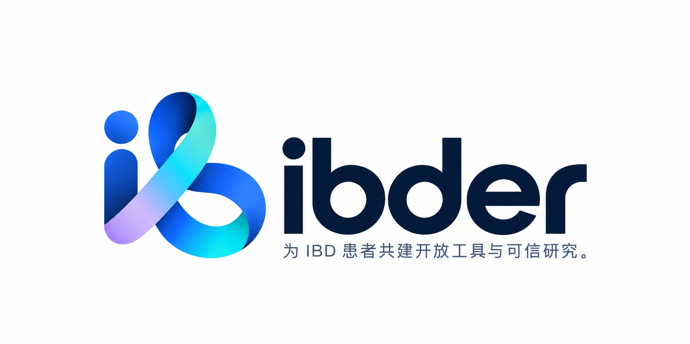

**简体中文** · [English](README.en.md)

  

# IBDer

### 把分散的信息变成可追溯的研究，把真实需求变成开放工具。

**为 IBD 患者共建开放工具与可信研究。**
从患者的真实问题出发，让研究、设计与技术在公开协作中沉淀为可复用的公共成果。

[浏览开放调研](https://github.com/IBDer/research) · [提出研究问题](https://github.com/IBDer/research/issues/new/choose) · [查看路线图](https://github.com/IBDer/.github/blob/main/ROADMAP.md) · [参与共建](https://github.com/IBDer/.github/blob/main/CONTRIBUTING.md)

---

## 为什么需要 IBDer？

与 IBD 一起生活，不只发生在诊室里。

症状与用药记录、饮食和生活方式、检查报告、复诊沟通、信息真伪判断，以及长期的不确定感，都会成为患者和家属每天面对的问题。但相关信息往往散落在论文、指南、产品、社群经验和个人记录中：**来源难追溯、证据边界不清楚、工具彼此割裂，患者很难真正参与问题定义。**

IBDer 希望补上这一层公共基础设施：

- 把值得回答的问题公开出来；
- 把来源、证据和不确定性整理清楚；
- 把可复用的方法沉淀为开放规范；
- 再把经过验证的需求做成工具，并与更大的开放生态连接。

我们不替患者做医疗决定。我们希望让每个人更容易找到依据、理解边界，并参与建设更好的解决方案。

## 从真实问题到公共成果

<table>
  <tr>
    <th align="center">01 · 提出问题</th>
    <th align="center">02 · 开放调研</th>
    <th align="center">03 · 沉淀规范</th>
    <th align="center">04 · 建设工具</th>
  </tr>
  <tr>
    <td align="center">由患者、家属和一线实践者提出真实且可回答的问题</td>
    <td align="center">记录检索方法、来源、证据类型、局限与审阅历史</td>
    <td align="center">形成可复用的术语、元数据、状态和互操作约定</td>
    <td align="center">开发小而可验证的产品，并逐步接入开放生态</td>
  </tr>
</table>

所有调研都遵循 **`Draft → Reviewed → Superseded`** 生命周期。`Reviewed` 代表来源与表述经过审阅，并不代表临床认可。

## 项目地图

| 方向 | 我们要解决什么 | 当前状态 | 入口 |
| --- | --- | :---: | --- |
| 🔎 **开放调研** | 让研究问题、来源、证据类型和不确定性可追溯 | **建设中** | [`IBDer/research`](https://github.com/IBDer/research) |
| 🧩 **数据与规范** | 统一术语、证据标签、项目状态和机器可读元数据 | 规划中 | 随真实调研需求逐步提炼 |
| 🛠️ **患者工具** | 支持记录、理解与日常管理，不替代专业医疗服务 | 探索中 | 先验证具体患者问题 |
| 🔗 **生态集成** | 与 OpenKHub 等开放知识和开源平台交换公共项目元数据 | 规划中 | 在接口与治理成熟后开放 |

我们选择先把研究方法和安全边界做扎实，而不是快速制造一批空仓库。完整阶段安排见[公开路线图](https://github.com/IBDer/.github/blob/main/ROADMAP.md)。

## 你可以从这里开始

<table>
  <tr>
    <td width="50%">
      <b>💬 我有一个值得研究的问题</b>  
      说明问题影响谁、为什么重要，以及你已经找到的来源。不要提交可识别的患者信息。  
      <a href="https://github.com/IBDer/research/issues/new/choose"><b>提出研究问题 →</b></a>
    </td>
    <td width="50%">
      <b>📚 我想阅读或补充调研</b>  
      查看调研模板、证据类型和机器可读目录，补充可靠来源或指出证据缺口。  
      <a href="https://github.com/IBDer/research"><b>进入 research 仓库 →</b></a>
    </td>
  </tr>
  <tr>
    <td width="50%">
      <b>🧑‍💻 我想参与产品与开源开发</b>  
      产品、设计、工程、数据、可访问性和文档工作都从明确的用户问题开始。  
      <a href="https://github.com/IBDer/.github/blob/main/CONTRIBUTING.md"><b>阅读参与指南 →</b></a>
    </td>
    <td width="50%">
      <b>🩺 我有临床或科研经验</b>  
      帮助核对来源、适用人群、证据局限、风险表达和研究方法，而不是为个人在线诊断。  
      <a href="https://github.com/IBDer/.github/blob/main/RESEARCH_POLICY.md"><b>查看调研规范 →</b></a>
    </td>
  </tr>
</table>

## 我们如何做出判断

<table>
  <tr>
    <td width="50%"><b>患者是共建者</b> 患者不只是工具使用者，也可以是问题提出者、范围定义者和体验评审者。</td>
    <td width="50%"><b>证据必须可追溯</b> 明确区分指南、研究、专家意见与患者经验，不用一个模糊分数掩盖差异。</td>
  </tr>
  <tr>
    <td width="50%"><b>隐私与安全先于功能</b> 不公开可识别的患者数据，不用增长目标交换隐私，也不越过医疗安全边界。</td>
    <td width="50%"><b>默认开放，允许接力</b> 公开问题、方法、决策和改进过程，让其他项目能够审阅、复用并继续建设。</td>
  </tr>
</table>

## 谁可以参与？

患者与家属、临床与科研人员、产品经理、设计师、开发者、数据工作者、翻译与内容贡献者，都可以找到自己的位置。你不需要公开诊断或个人病史，也不需要先成为 IBD 专家；尊重隐私、说明依据、愿意接受审阅，比身份标签更重要。

> [!IMPORTANT]
> IBDer 不提供诊断、个体化治疗建议、疾病活动评分或紧急服务，也不判断某种食物是否导致个人症状。这里的内容不能替代专业医疗人员的判断。紧急情况下，请立即联系当地急救服务。

---

**Open tools and shared research for living with IBD.**

[行为准则](https://github.com/IBDer/.github/blob/main/CODE_OF_CONDUCT.md) · [治理方式](https://github.com/IBDer/.github/blob/main/GOVERNANCE.md) · [安全报告](https://github.com/IBDer/.github/blob/main/SECURITY.md) · [支持边界](https://github.com/IBDer/.github/blob/main/SUPPORT.md)

